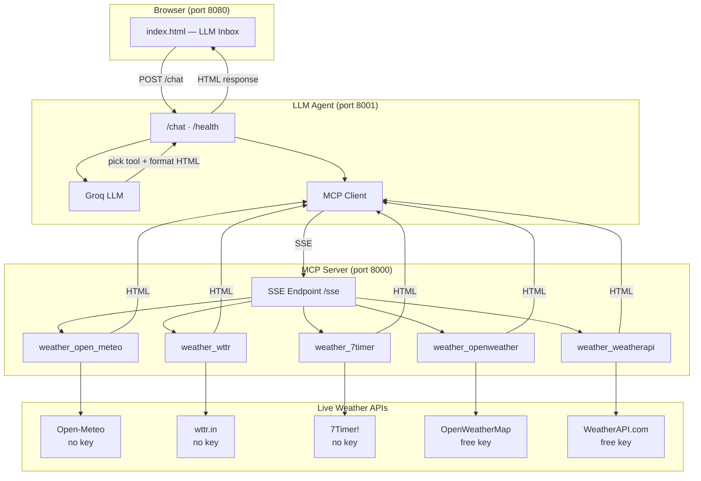

# Weather MCP Server

A **Model Context Protocol (MCP)** server built with [fastmcp](https://gofastmcp.com) that exposes **exactly 5 weather tools**, each calling a different **live public weather API**. Includes a **Groq-powered LLM agent** and a browser **inbox UI** — you ask a weather question in plain English, the LLM picks the right MCP tool, and returns an HTML answer.

---

## Architecture Diagram



---

## The 5 Tools & APIs

| # | MCP Tool | Weather API | API Key Required? |
|---|----------|-------------|-------------------|
| 1 | `weather_open_meteo` | [Open-Meteo](https://open-meteo.com/) | No |
| 2 | `weather_wttr` | [wttr.in](https://wttr.in/) | No |
| 3 | `weather_7timer` | [7Timer!](https://www.7timer.info/) | No |
| 4 | `weather_openweather` | [OpenWeatherMap](https://openweathermap.org/api) | Yes (free tier) |
| 5 | `weather_weatherapi` | [WeatherAPI.com](https://www.weatherapi.com/) | Yes (free tier) |

### API Keys

| Key | Required for | Sign up |
|-----|--------------|---------|
| `GROQ_API_KEY` | LLM inbox UI (`agent.py`) | https://console.groq.com/keys (free tier) |
| `OPENWEATHER_API_KEY` | Tool 4 only (optional) | https://openweathermap.org/api |
| `WEATHERAPI_KEY` | Tool 5 only (optional) | https://www.weatherapi.com/signup.aspx |

Tools 1–3 work with no keys. For the inbox UI, **Groq is required**. Weather keys for tools 4–5 are optional — the LLM will pick from whichever tools are available.

1. Copy `.env.example` to `.env`
2. Add your `GROQ_API_KEY` (required for inbox)
3. Optionally add weather API keys for tools 4–5

---

## Quick Start

### 1. Install dependencies

```bash
git clone https://github.com/RimeetMavani/weather-mcp--build.git
cd weather-mcp--build
pip install -r requirements.txt
```

### 2. Configure API keys

```bash
copy .env.example .env
# Edit .env — add GROQ_API_KEY (free tier, required for LLM inbox)
# Optionally add free weather API keys for tools 4–5
```

### 3. Start the MCP server (SSE on port 8000)

```bash
python server.py
```

You should see output like:

```
Starting MCP server 'Weather MCP Server' with transport 'sse' on http://127.0.0.1:8000/sse
```

**Keep this terminal open.**

### 4. Start the LLM agent (port 8001)

Open a **second terminal**:

```bash
python agent.py
```

The agent lists MCP tools, lets the Groq LLM pick one for your question, calls the tool, and returns an HTML answer.

### 5. Serve the HTML inbox UI (port 8080)

Open a **third terminal**:

```bash
python -m http.server 8080
```

### 6. Open the browser UI

Go to: **http://localhost:8080/index.html**

1. Wait for status dots to turn green (agent, MCP, LLM)
2. Type a weather question in the **inbox** (no tool dropdown — the LLM chooses)
3. View the **HTML-formatted** LLM response

---

## 5 Suggested Inbox Questions

These match the clickable prompts in `index.html`. The LLM picks the tool — you do not select one manually.

| Question | Expected tool (LLM may vary) |
|----------|------------------------------|
| What's the weather in London? | Open-Meteo or wttr.in |
| How hot is it in Tokyo right now? | Temperature-focused tool |
| Is it good stargazing weather in Paris tonight? | 7Timer! |
| Tell me about the weather in New York | OpenWeatherMap (if key set) |
| What's the humidity and wind like in Sydney? | Best matching tool |

---

## CLI Test (all 5 tools)

With `server.py` running in another terminal:

```bash
python test_client.py
```

This connects via SSE, lists tools, calls all 5 with live data, prints previews, then closes the connection. This tests the MCP server directly — no Groq agent needed.

---

## Project Files

| File | Purpose |
|------|---------|
| `server.py` | MCP server — 5 weather tools, SSE transport |
| `agent.py` | Groq LLM agent — picks MCP tool, returns HTML answer |
| `index.html` | Inbox UI — ask weather questions via agent on port 8001 |
| `test_client.py` | Python script to test all 5 MCP tools from the terminal |
| `requirements.txt` | Python dependencies |
| `.env.example` | Template for API keys (Groq + optional weather keys) |

---

## End Testing

1. Close the browser tab
2. Stop the HTML server: `Ctrl+C` in the http.server terminal
3. Stop the agent: `Ctrl+C` in the agent.py terminal
4. Stop the MCP server: `Ctrl+C` in the server.py terminal
